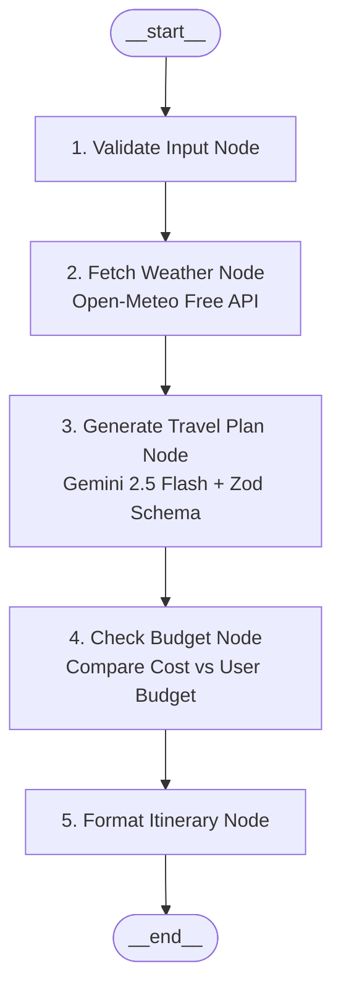

# ✈️ AI Travel Planner

A full-stack, beginner-friendly AI travel planning application built with **React**, **Express.js**, **LangGraph.js**, and **Google Gemini (Free Tier)**.

The application takes a user's destination, duration, budget, and travel preferences, and executes a multi-node LangGraph state machine to generate a personalized, budget-verified, weather-aware day-by-day travel itinerary.

---

## 🌟 Key Features

1. **Multi-Node LangGraph Architecture**: Orchestrates input validation, live weather fetching, AI plan synthesis, budget analysis, and response formatting in an explicit state graph.
2. **Personalized Day-by-Day Itineraries**: Breaks down each day into morning, afternoon, and evening activities, plus authentic local dishes and recommended restaurants.
3. **Live Weather Integration**: Connects to the free Open-Meteo API to fetch real-time climate data (temperature, wind, conditions) and adjust travel recommendations.
4. **Intelligent Budget Checking**: Automatically calculates estimated total costs against the user's budget and provides cost-saving recommendations if the plan exceeds budget.
5. **Structured AI Generation with Zod**: Enforces typed JSON schemas for reliable, zero-hallucination structured responses from Gemini.
6. **Saved Trips**: Save favorite itineraries to revisit or modify anytime.
7. **100% Free Tier Compatible**: Powered by Gemini 2.5 Flash and free weather geocoding.

---

## 🏗️ Architecture & LangGraph Workflow



### **LangGraph State Lifecycle**

| Step | Node Name | Description |
| :--- | :--- | :--- |
| **1** | `validateInput` | Checks that destination is provided, days are within 1–14, and budget is positive. |
| **2** | `fetchWeather` | Geocodes city to coordinates and fetches current temperature and conditions via Open-Meteo. |
| **3** | `generatePlan` | Sends structured prompt to Gemini with user constraints, live weather, and selected interests. |
| **4** | `checkBudget` | Sums daily costs, compares against user budget, and generates surplus/deficit advice. |
| **5** | `formatResponse` | Formats and packages the final typed JSON object for the frontend. |

---

## 🛠️ Tech Stack

- **Frontend**: React 19, TypeScript, Vite, Tailwind CSS, Lucide Icons
- **Backend**: Node.js, Express.js, TypeScript
- **AI & Orchestration**: LangGraph.js (`@langchain/langgraph`), LangChain.js (`@langchain/core`), Google Gemini (`@langchain/google-genai`)
- **Weather API**: Open-Meteo (100% Free, No API Key Required)
- **Validation**: Zod (Structured LLM Output)

---

## 📁 Project Structure

```text
ai-travel-planner/
├── client/                         # React Frontend (Vite + TypeScript + Tailwind)
│   ├── src/
│   │   ├── components/
│   │   │   ├── Navbar.tsx          # Navigation header & saved trips count
│   │   │   ├── TripForm.tsx        # Destination, days, budget & interest tags
│   │   │   ├── ItineraryCard.tsx   # Day tabs, time-slot cards, food & tips
│   │   │   ├── BudgetSummary.tsx   # Budget comparison badge & advice
│   │   │   ├── WeatherBadge.tsx    # Live destination temperature & conditions
│   │   │   ├── LoadingSkeleton.tsx # Multi-step LangGraph animation
│   │   │   └── SavedTripsModal.tsx # Stored itineraries modal
│   │   ├── services/
│   │   │   └── api.ts              # API client communicating with Express
│   │   ├── types/
│   │   │   └── travel.ts           # Shared TypeScript interfaces
│   │   ├── App.tsx                 # Main layout & application state
│   │   ├── main.tsx                # React DOM render entry
│   │   └── index.css               # Global Tailwind CSS styles
│   ├── package.json
│   ├── tsconfig.json
│   └── vite.config.ts
│
├── server/                         # Node.js + Express Backend
│   ├── src/
│   │   ├── config/
│   │   │   └── env.ts              # Environment variable configuration
│   │   ├── graph/
│   │   │   ├── state.ts            # LangGraph Annotation & state schema
│   │   │   ├── nodes.ts            # The 5 graph processing nodes
│   │   │   └── travelGraph.ts      # Compiled StateGraph workflow
│   │   ├── services/
│   │   │   ├── gemini.ts           # Google Gemini model initializer
│   │   │   └── weather.ts          # Open-Meteo weather & geocoding service
│   │   ├── routes/
│   │   │   └── travelRoutes.ts     # Express endpoints (/plan-trip, /trips)
│   │   ├── storage/
│   │   │   └── tripStore.ts        # In-memory & pluggable persistence
│   │   └── server.ts               # Express server entry point
│   ├── package.json
│   └── tsconfig.json
│
├── .env                            # Active environment variables
├── .env.example                    # Template environment variables
├── package.json                    # Root scripts
└── README.md                       # Documentation
```

---

## 🚀 Quick Start Guide

### 1. Prerequisites
- **Node.js** (v18 or higher)
- **Google Gemini API Key** (Free from [Google AI Studio](https://aistudio.google.com/))

### 2. Setup Environment Variables
Create a `.env` file in the `ai-travel-planner/` folder:
```bash
GEMINI_API_KEY=your_gemini_api_key_here
PORT=5000
```

### 3. Run the Backend Server
```bash
cd ai-travel-planner/server
npm install
npm run dev
```
*Backend runs at `http://localhost:5000`*

### 4. Run the React Frontend
In a new terminal:
```bash
cd ai-travel-planner/client
npm install
npm run dev
```
*Frontend runs at `http://localhost:5173`*

---

## 📡 API Endpoints

### `POST /api/plan-trip`
Executes the LangGraph pipeline to generate an itinerary.

**Request Body:**
```json
{
  "destination": "Manali",
  "days": 3,
  "budget": 12000,
  "currency": "INR",
  "interests": ["Nature", "Adventure", "Food"]
}
```

**Response (200 OK):**
```json
{
  "success": true,
  "data": {
    "destination": "Manali",
    "days": 3,
    "userBudget": 12000,
    "currency": "INR",
    "weather": {
      "destination": "Manali, India",
      "temperatureCelsius": 18,
      "temperatureFahrenheit": 64,
      "condition": "Mainly clear, partly cloudy",
      "windSpeedKmh": 7
    },
    "budgetAnalysis": {
      "userBudget": 12000,
      "estimatedTotalCost": 11500,
      "isOverBudget": false,
      "difference": 500,
      "advice": "Great news! The estimated total cost (11500 INR) is within your budget..."
    },
    "itinerary": [
      {
        "day": 1,
        "morning": "Visit the ancient wooden Hadimba Devi Temple in the cedar forest.",
        "afternoon": "Explore Old Manali cafes and Manu Temple.",
        "evening": "Stroll down Mall Road for local shopping and street food.",
        "food": "Try authentic Siddu and fresh Himalayan trout.",
        "estimatedCost": 3500
      }
    ],
    "tips": [
      "Carry light woolens even in summer as evenings can get chilly.",
      "Book adventure activities through licensed operators in Solang Valley."
    ]
  }
}
```

---

## 🎓 College Placement Interview Q&A Guide

Here are explanations for the core concepts used in this project that interviewers frequently ask:

### 1. What is LangChain and what is LangGraph?
- **LangChain**: A framework for building applications powered by Large Language Models (LLMs) with utilities for prompt management, models, and tools.
- **LangGraph**: An orchestration extension of LangChain designed for **stateful, multi-step, and multi-agent workflows**. It models LLM applications as **graphs** containing **State**, **Nodes**, and **Edges**.

### 2. Why use LangGraph instead of a single LLM prompt?
- A single prompt is a "black box" that tries to do validation, weather lookup, plan generation, and budget math all at once—frequently resulting in calculation errors and hallucinations.
- **LangGraph separates concerns**:
  - Node 1 handles validation deterministically.
  - Node 2 calls an external weather API.
  - Node 3 focuses strictly on creative travel planning.
  - Node 4 handles exact mathematical budget calculations in code.
  - Node 5 structures the payload.
- This creates **modular, testable, and debuggable** production code.

### 3. What are State, Nodes, and Edges in LangGraph?
- **State (`TravelState`)**: The central typed data structure passed between nodes. Each node reads from state and returns updates.
- **Nodes**: JavaScript/TypeScript functions that perform a single unit of work (e.g. calling an API or running an LLM).
- **Edges**: Directed connections that define the execution path between nodes (e.g., from `validateInput` to `fetchWeather`).

### 4. How are API keys protected?
- API keys are stored strictly in server-side `.env` files and never exposed to the client bundle.
- The client communicates only with the Express API (`/api/plan-trip`), which communicates securely with the Gemini API.

